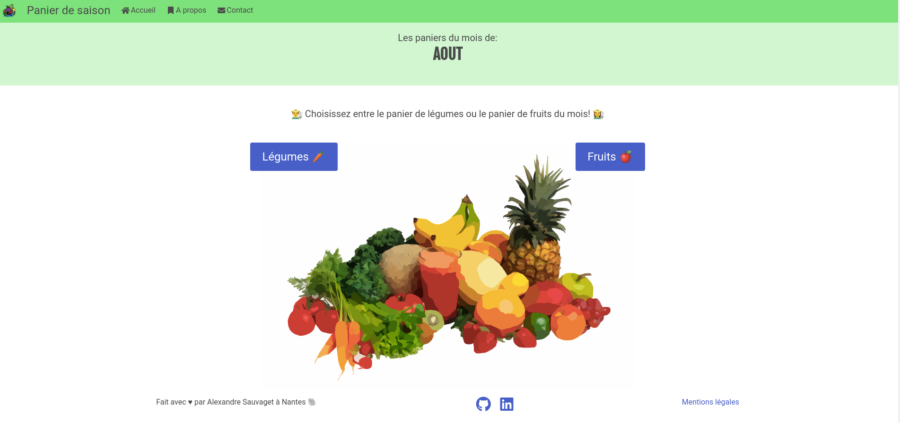
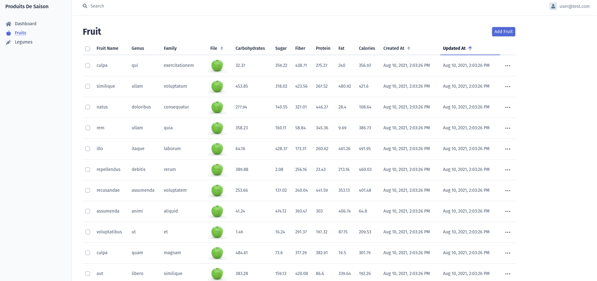

<h1 align="center">Welcome to panier-de-saison 👋</h1>
<p>
  
  
</p>

> &#34;Panier de saison&#34; est une application Web destinée à tous. Elle a pour but de proposer la liste des fruits et légumes disponible (de saison) à la vente mois par mois.&#34;



## Vidéo de démonstration

## Pré-requis

- PHP 8.0
- Composer
- Symfony CLI
- Docker
- Docker-composer
- Node.js et NPM

Vous pouvez vérifier les pré-requis (sauf Docker et Docker-compose) avec la commande suivante (Symfony CLI) :

```bash
symfony check:requirements
```

## Lancer l'environnement de développement

```bash
composer install
npm install
npm run build
docker-compose up -d
symfony serve -d
```

## Lancer les tests unitaires

```bash
php bin/phpunit --testdox
```

## Visualiser la couverture du code

```bash
XDEBUG_MODE=coverage ./vendor/bin/phpunit --coverage-html ./tests/test-coverage
```

### Ajouter des données factices

Une fois les entités créées, effectuer les migrations plus ajout de données.

```bash
symfony console make:migration
symfony console d:m:m
symfony console doctrine:fixtures:load
```

Pour visualiser les données:

- installer l'extension VSCode: Docker (https://marketplace.visualstudio.com/items?itemName=ms-azuretools.vscode-docker)
- Dans l'extension, clic droit sur le container contenant la BDD -> `Attach shell`
- Se connecter à la bdd: `mysql -p`
- `use main`

### Autre

Le sitemap du site est disponible à l'adresse: `/sitemap.xml`.

## Création BDD de test

BDD dédié à l'execution de tests.

```bash
APP_ENV=test symfony console doctrine:database:create
APP_ENV=test symfony console doctrine:migrations:migrate -n
APP_ENV=test symfony console doctrine:fixtures:load
```

Pour lancer les tests:

```bash
APP_ENV=test symfony php bin/phpunit --coverage-html ./tests/test-coverage
```

## BackOffice

L'url d'accès au backoffice est le suivant : `/admin`.</br>
Vous devrez alors vous connecter avec l'adresse de test `user@test.com` et le mot de passe `password`.
Vous pouvez effectuer les actions du CRUD.



## Production

### Envoie des mails de Contacts

Les mails de prise de contact sont stockés en BDD. Pour les envoyer au 'PRODUCT_MANAGER' par mail, il faut mettre en place un **cron** (https://docs.ovh.com/fr/hosting/mutualise-taches-automatisees-cron/) sur:

```bash
symfony console app:send-contact
```

## Auteur

👤 **Alexandre Sauvaget**

- Website: https://a-sauvaget.github.io/a.sauvaget-portfolio/
- Github: [@a-sauvaget](https://github.com/a-sauvaget)
- LinkedIn: [@https:\/\/www.linkedin.com\/in\/alexandresauvaget\/](https://linkedin.com/in/https://www.linkedin.com/in/alexandresauvaget/)
